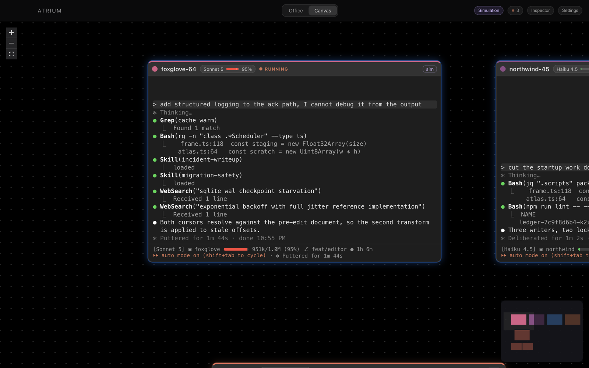

<div align="center">

# Atrium

**A visual companion for Claude Code.** It watches `~/.claude`, never touches it, and draws what your sessions are actually doing.

[](https://github.com/Tennis-Ball/cc_session_viz/releases/latest)

[**Download the latest release →**](https://github.com/Tennis-Ball/cc_session_viz/releases/latest)

Universal · Apple Silicon and Intel · macOS 12+


</div>

## Install

1. Download **`Atrium-<version>.dmg`** from [the latest release](https://github.com/Tennis-Ball/cc_session_viz/releases/latest).
2. Open it and drag **Atrium** into Applications.
3. Open Atrium.

<details>
<summary><b>First launch shows a warning. Here is what it is and how to get past it.</b></summary>

<br>

macOS will say it *"could not verify Atrium is free of malware"*.

That is Gatekeeper telling you the app is not signed with a paid Apple Developer certificate ($99/year). It is not a virus scan and it has not found anything — it simply cannot identify who built the app. Every notarization-free macOS app gets this, and as of September 2026 there is no way around it short of buying the certificate.

**To open it anyway — once, then never again:**

- **macOS 15 (Sequoia) and later** — open Atrium, dismiss the dialog, then go to  **System Settings → Privacy & Security**, scroll to the bottom, and click **Open Anyway**.
- **macOS 14 and earlier** — right-click Atrium in Applications and choose **Open**.

**If it instead says "Atrium is damaged and can't be opened"**, the download was corrupted — that message means macOS could not validate the bundle at all, which is a different thing from not recognising who signed it. Download `SHA256SUMS.txt` from the same release, put it next to the `.dmg`, and check:

```bash
cd ~/Downloads && shasum -a 256 -c SHA256SUMS.txt
```

If that does not say `OK`, download the `.dmg` again.

</details>

## What it does

Atrium reads the same `~/.claude` directory Claude Code already writes to, and shows it two ways.

### Office

Every session gets a desk. Its agents walk to whichever part of the campus matches what they are actually running — the Library to read files, the Workshop to run commands, the Atelier to think and plan, the Watchtower to sit with background tasks, the Commons to spawn subagents, the Lounge when there is nothing to do. The paper stack on a desk is how full that session's context is. A ring over someone's head means they are waiting on you.

The point is peripheral vision: you can tell across the room that something needs you, without reading anything.

### Canvas



A board of terminal cards, one per session, each rebuilding the Claude Code TUI from the transcript — the same spinner, the same `● Bash(...)` rows, the same status line. Subagents hang below their parent on copper edges. Two-finger scroll pans, pinch zooms.

### And

- A **menu bar glance** — session list, context bars, what each one is doing — without bringing a window forward.
- A **usage panel** reading your real limits from the OAuth token Claude Code already stores, with a local estimate as the fallback.
- **Day/night lighting** that follows your clock, six themes, and optional ambient music.
- A **simulation** (`⌥S`) that fills the office with invented sessions when you have none running. It is generated from nothing and never contains, or borrows from, anything real.

## Requirements

- macOS 12 or later — Apple Silicon or Intel
- [Claude Code](https://code.claude.com/docs) installed, with a `~/.claude` directory

## What it does with your data

Atrium is a viewer. That is worth being precise about, because it is pointed at a directory full of your work:

- **It never writes to `~/.claude`.** Every read is read-only. The only file it writes anywhere is its own preferences, under the app's `userData` directory.
- **It makes no network calls**, with one exception: if you turn on live usage limits, it calls Anthropic's own API and nothing else. Turn it off and the app never opens a socket.
- **No telemetry, no accounts, no analytics, no crash reporting.**
- **Your Claude Code credentials are read once per launch**, kept in memory, never written down, never refreshed, and never logged. If reading them fails for any reason the app falls back to a local estimate and carries on.
- **Open source, MIT.** All of the above is checkable — start at `src/engine/`.

## Building it yourself

Requires [Node.js](https://nodejs.org) 24+ and npm. No Xcode, no Rust.

```bash
npm install
npm run dev        # the app, with hot reload

npm run typecheck  # three tsconfig projects: node, web, tests
npm test           # unit tests
npm run e2e        # launches the built app and captures artifacts/shots/

npm run dist       # a universal Atrium.dmg in dist/
npm run dist:fast  # Apple Silicon only, for a quicker local build
```

Keyboard: `⌘1` / `⌘2` switch views, `⌘,` opens Settings, `⌥S` swaps between your sessions and the simulation. In the office, drag to orbit, scroll to zoom, `[` / `]` swing 45°, `0` resets.

<details>
<summary><b>Repository layout</b></summary>

<br>

```
src/shared/     the contract: World, TranscriptEntry, VisualEvent, protocol, palette
src/main/       Electron main: windows, the menu bar tray, the engine utilityProcess, port broker
src/preload/    contextBridge: a MessagePort relay and nothing else
src/engine/     runs in a utilityProcess
  discovery/    the live registry and where a session's files are
  io/           incremental tailing of append-only JSONL
  parse/        normalize.ts is the ONLY module that knows Claude Code field names
  state/        reducers, liveness, transcript logs
  sources/      live, the simulation, mock
src/renderer/
  canvas/       React Flow board, terminal cards, the TUI replica
  office/       react-three-fiber scene: facet material, campus, figures
  tray/         the menu bar popover, the same bundle loaded at #tray
build/          entitlements, used only on the signed path
resources/      icons, rendered by scripts/render-icon.ts and render-tray-icon.ts
fixtures/       anonymized real sessions, used by the engine tests
scripts/        schema-drift.ts (read-only probe), record-fixture.ts, render-*-icon.ts
```

**Two rules hold the codebase together:**

1. **`normalize.ts` is the only place that knows the transcript format.** It changes between Claude Code point releases; everything downstream speaks `Signal`. `node scripts/schema-drift.ts` reports anything new.
2. **One material, one prop kit, one palette.** The office is unlit: faces take their tone from the direction they point. Every object goes through `office/props/kit.ts` so the whole place stays one picture.

</details>

<details>
<summary><b>Cutting a release</b></summary>

<br>

Releases are built by GitHub Actions on a tag, never by hand:

```bash
npm version minor        # bumps package.json and tags
git push --follow-tags
```

`.github/workflows/release.yml` then typechecks, runs the tests, refuses the tag if it disagrees with `package.json`, builds the universal DMG, verifies the bundle signature is intact, and opens a **draft** release. Publishing the draft is the release switch.

**To ship without the Gatekeeper warning**, add these five repository secrets and change nothing else — `electron-builder.config.cjs` detects them and switches to Developer ID signing with the hardened runtime, entitlements and notarization:

| Secret | Where it comes from |
|---|---|
| `CSC_LINK` | your Developer ID Application `.p12`, base64-encoded |
| `CSC_KEY_PASSWORD` | the password you exported the `.p12` with |
| `APPLE_ID` | the Apple ID on the developer account |
| `APPLE_APP_SPECIFIC_PASSWORD` | generated at [appleid.apple.com](https://appleid.apple.com) |
| `APPLE_TEAM_ID` | the 10-character team ID |

Without them the build ad-hoc signs instead. That is not a formality: an ad-hoc signature seals the bundle and binds its `Info.plist`, which is the difference between the ordinary "unidentified developer" prompt and macOS reporting the app as **damaged**.

</details>

## Licence

MIT © Mason Choi
